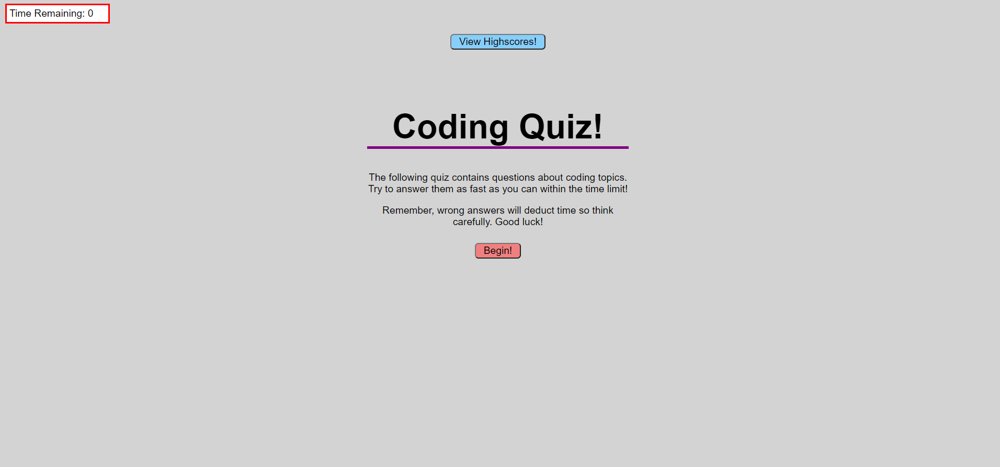

## Javascript Coding Quiz
The following app is a coding quiz centered around javascript.

Upon opening the page, the user is met with the quiz start page. Once the quiz is started,
the used has 80 seconds to answer 4 questions correctly, each incorrect answer will
deduct time from the timer. Upon answering all 4 questions and completing the quiz, this user
is taken to the end-game screen where they may enter their initials to keep track of their highscore.

## App URL
https://jch95.github.io/coding-quiz/

## Screenshot
